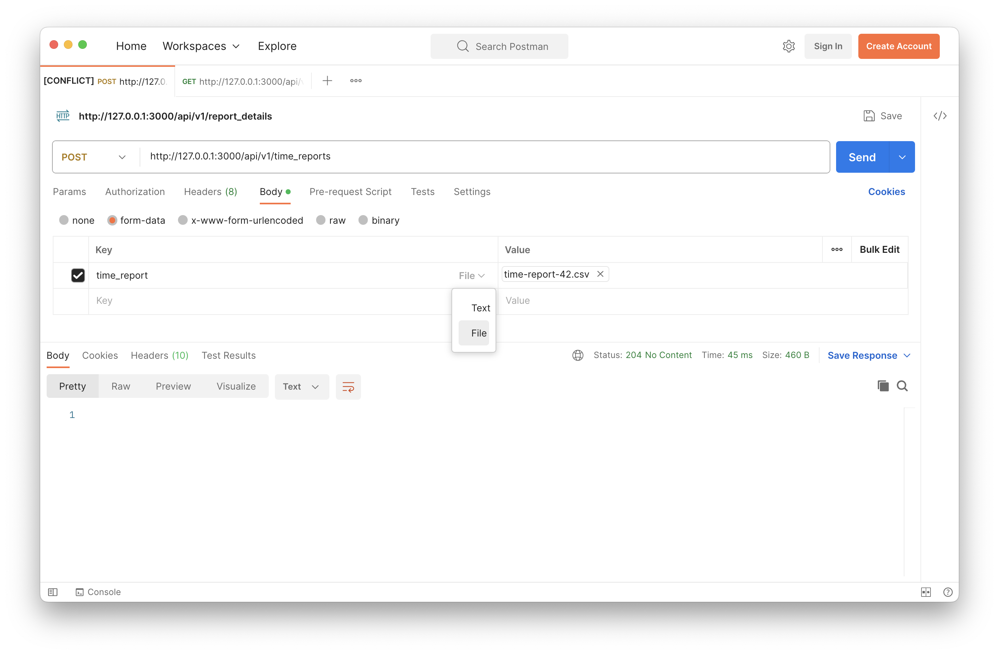
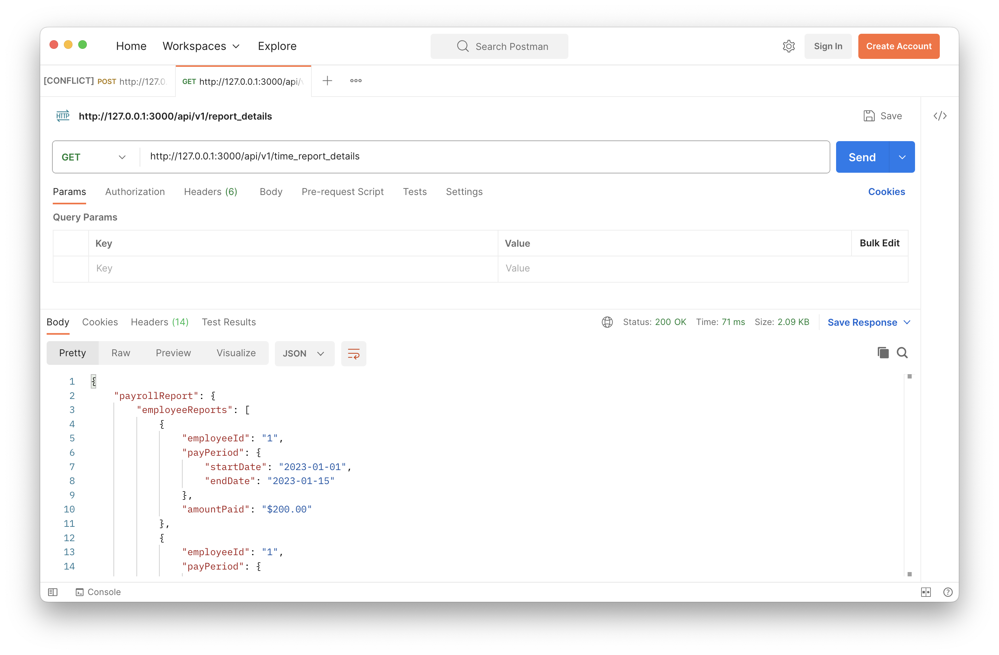

## Project Description

Imagine that this is the early days of Wave's history, and that we are prototyping a new payroll system API. A front end (that hasn't been developed yet, but will likely be a single page application) is going to use our API to achieve two goals:

1. Upload a CSV file containing data on the number of hours worked per day per employee
1. Retrieve a report detailing how much each employee should be paid in each _pay period_

All employees are paid by the hour (there are no salaried employees.) Employees belong to one of two _job groups_ which determine their wages; job group A is paid $20/hr, and job group B is paid $30/hr. Each employee is identified by a string called an "employee id" that is globally unique in our system.

Hours are tracked per employee, per day in comma-separated value files (CSV).
Each individual CSV file is known as a "time report", and will contain:

1. A header, denoting the columns in the sheet (`date`, `hours worked`, `employee id`, `job group`)
1. 0 or more data rows

In addition, the file name should be of the format `time-report-x.csv`,
where `x` is the ID of the time report represented as an integer. For example, `time-report-42.csv` would represent a report with an ID of `42`.

You can assume that:

1. Columns will always be in that order.
1. There will always be data in each column and the number of hours worked will always be greater than 0.
1. There will always be a well-formed header line.
1. There will always be a well-formed file name.

A sample input file named `time-report-42.csv` is included in this repo.

### What your API must do:

We've agreed to build an API with the following endpoints to serve HTTP requests:

1. An endpoint for uploading a file.

  - This file will conform to the CSV specifications outlined in the previous section.
  - Upon upload, the timekeeping information within the file must be stored to a database for archival purposes.
  - If an attempt is made to upload a file with the same report ID as a previously uploaded file, this upload should fail with an error message indicating that this is not allowed.

2. An endpoint for retrieving a payroll report structured in the following way:

  _NOTE:_ It is not the responsibility of the API to return HTML, as we will delegate the visual layout and redering to the front end. The expectation is that this API will only return JSON data.

  - Return a JSON object `payrollReport`.
  - `payrollReport` will have a single field, `employeeReports`, containing a list of objects with fields `employeeId`, `payPeriod`, and `amountPaid`.
  - The `payPeriod` field is an object containing a date interval that is roughly biweekly. Each month has two pay periods; the _first half_ is from the 1st to the 15th inclusive, and the _second half_ is from the 16th to the end of the month, inclusive. `payPeriod` will have two fields to represent this interval: `startDate` and `endDate`.
  - Each employee should have a single object in `employeeReports` for each pay period that they have recorded hours worked. The `amountPaid` field should contain the sum of the hours worked in that pay period multiplied by the hourly rate for their job group.
  - If an employee was not paid in a specific pay period, there should not be an object in `employeeReports` for that employee + pay period combination.
  - The report should be sorted in some sensical order (e.g. sorted by employee id and then pay period start.)
  - The report should be based on all _of the data_ across _all of the uploaded time reports_, for all time.

As an example, given the upload of a sample file with the following data:

  | date       | hours worked | employee id | job group |
  | ---------- | ------------ | ----------- | --------- |
  | 4/1/2023   | 10           | 1           | A         |
  | 14/1/2023  | 5            | 1           | A         |
  | 20/1/2023  | 3            | 2           | B         |
  | 20/1/2023  | 4            | 1           | A         |

A request to the report endpoint should return the following JSON response:

```json
  {
    "payrollReport": {
      "employeeReports": [
        {
          "employeeId": "1",
          "payPeriod": {
            "startDate": "2023-01-01",
            "endDate": "2023-01-15"
          },
          "amountPaid": "$300.00"
        },
        {
          "employeeId": "1",
          "payPeriod": {
            "startDate": "2023-01-16",
            "endDate": "2023-01-31"
          },
          "amountPaid": "$80.00"
        },
        {
          "employeeId": "2",
          "payPeriod": {
            "startDate": "2023-01-16",
            "endDate": "2023-01-31"
          },
          "amountPaid": "$90.00"
        }
      ]
    }
  }
```

## How to build the application

- `ruby` version `3.1.4`
- `rails` version `7.0.8`
- `sqlite3` version `3.39.5`

---

- To install the gems, execute the `bundle install` command from the root of the project
- To run the migrations, execute the `rails db:migrate` command from the root of the project

## How to run the application

- To start the rails server, execute the `rails s` command from the root of the project
- To start the rails console, execute the `rails c` command from the root of the project
- To run the tests, execute the `rspec spec` command from the root of the project

## How to test the application

Use Postman to test the endpoints manually.

To test the endpoint for uploading a time report, send a `POST` request to the `http://127.0.0.1:3000/api/v1/time_reports` URL, and attached the CSV by selecting `Body`, then `form-data`, entering `time_report` for key name and selecting `file` for key type, then selecting the CSV file through the `Select Files` button.



To test the endpoint for retrieving the payroll report, send a `GET` request to the `http://127.0.0.1:3000/api/v1/time_report_details` URL.



### Test cases

- no report
- 0 records
- 1 record
- 2 records
- different report id, duplicate records
- report with an id already in the DB
- multiple years in a single report
- many records in a single report
